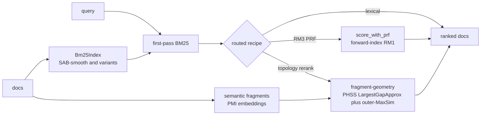

# simeon

Training-free SIMD text embeddings. Deterministic, model-free `text -> vector`
for dense retrieval. NEON/AVX2 kernels. Single-digit microseconds per doc.


> [!WARNING]
> Experimental. API and defaults may change. `simeon` is not learned semantic encoder.

## What It Is

`simeon` maps UTF-8 text to fixed-width float vectors with no learned model.

```text
text -> optional ASCII case fold -> whole-text or word-bounded char/word n-grams -> hashed count sketch -> optional random projection
     -> optional matryoshka weights -> L2 normalize -> optional PQ code
```

Same input + same config + same seed is deterministic within a SIMD tier. Record
the active tier when byte-level reproducibility matters; reduction order can
differ across scalar, NEON, and AVX2 implementations.

The retrieval side composes these primitives into a first-pass + rerank pipeline.
A first-pass BM25 (SAB-smooth by default) produces the candidate scores; a routed
recipe then either returns them, expands them with RM3 pseudo-relevance feedback,
or reranks with fragment-geometry topology:



## What Ships

- Embedding core: feature hashing plus Achlioptas, SparseJL, FWHT, very-sparse,
  and dense Gaussian projections.
- Corpus-adaptive embedding: bounded, serializable hashed-IDF artifacts built
  from deployment documents without labels or gradient training.
- Nested output: matryoshka-style prefix use from one projection.
- Compression: Product Quantization + ADC.
- Retrieval core: BM25 variants, fusion helpers, query router.
- Structured retrieval hooks: corpus adapters.
- Runtime: aarch64 NEON, x86 AVX2+FMA, scalar fallback.
- Build: C++20, Meson, zero runtime deps.

## Positioning

- Good fit: first-stage recall, lexical+dense fusion, model-free or on-device retrieval.
- Not good fit: paraphrase or semantic equivalence. Not drop-in replacement for MiniLM-class bi-encoder.
- Benchmarks, router notes, ablations, and negative results live in [docs/research.md](docs/research.md).

## Build

```sh
meson setup build
meson compile -C build
meson test -C build
```

Requires C++20, Meson, Ninja. Full build options: [docs/build.md](docs/build.md).

## Quick Start

```cpp
#include <simeon/simeon.hpp>

simeon::EncoderConfig cfg = simeon::compact_retrieval_config();

simeon::Encoder enc(cfg);
std::vector<float> out(enc.output_dim());
enc.encode("training-free text embeddings", out.data());
```

The compact preset is a frozen 384-dimensional, word-bounded character 3–5
gram plus word-token recipe. It has no learned or corpus-fitted artifact;
ordinary `EncoderConfig` defaults remain backward compatible.

For the promoted corpus-adaptive quality path, build a 65,536-bucket
`HashedIdf` from the deployment corpus and pass it to
`compact_hashed_idf_retrieval_config()`. The artifact is 128 KiB and must be
rebuilt or reloaded when the corpus or encoder identity changes. When retrieval
quality warrants twice the vector storage and roughly 1.8–2.0x exact-scoring
cost, `quality_hashed_idf_retrieval_config()` retains 768 rather than 384 FWHT
coordinates.

Public headers:

- `<simeon/simeon.hpp>`: encoder
- `<simeon/hashed_idf.hpp>`: corpus-adaptive document-frequency artifact
- `<simeon/pq.hpp>`: PQ + ADC
- `<simeon/retrieval.hpp>`: BM25, fusion, router
- `<simeon/corpus_adapter.hpp>`: structured corpus hooks

## Docs

- Build: [docs/build.md](docs/build.md)
- Reusable experiments: [docs/experimentation.md](docs/experimentation.md)
- Research notes: [docs/research.md](docs/research.md)
- Works cited: [docs/works_cited.md](docs/works_cited.md)

## Status

- Stable surface: tokenizer, hashing, projection heads, normalization, SIMD dispatch, matryoshka, PQ, retrieval core.
- Opt-in surface: BM25F, SDM/WSDM, RM3 pseudo-relevance feedback, concept mining, fragment-geometry rerank.

## Citation

Cite software via [CITATION.cff](CITATION.cff). Use [docs/research.md](docs/research.md) for claim-to-document mapping.

## License

GPL-3.0-or-later.
